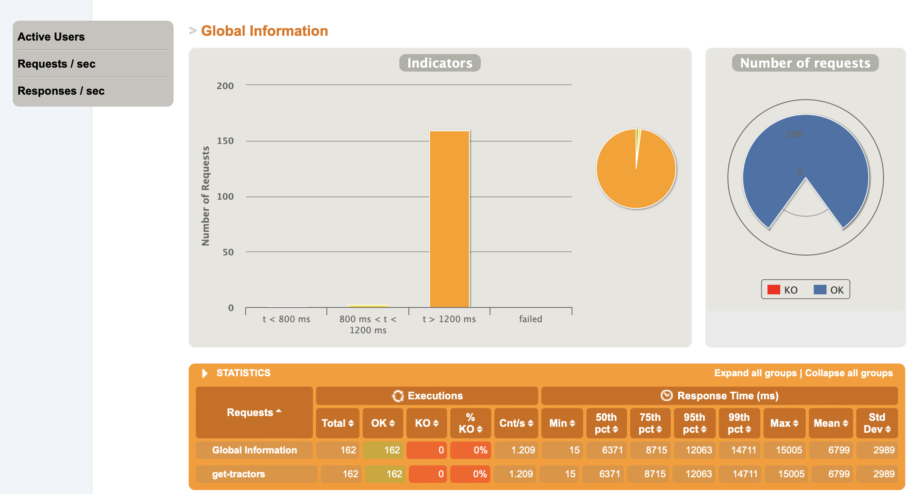

# Benchmarks web services

**Objective**: use differents tools to implement the same web service and compare their behaviour under pressure

- Each web API exposes same route doing the same treatment on the same amount of data of same format (JSON)

**Scenario**:

- Get a random GPS position in a 50km radius from a referencial (e.g. Paris's GPS position)
- call the web api to get tractors around that position

This way, there is no way some caching magic on the web-api side is triggered since it's less
likely that requests to the API will have similar payload (because of positions changes)

## Run the loadtest

Easy:

- build the docker images for each web api

```sh
# GOLANG
docker build -t web-api:go -f Dockerfile.go .
# Pyhton
docker build -t web-api:python -f Dockerfile.python .
# NodeJS
docker build -t web-api:nodejs -f Dockerfile.nodejs .
```

Then, from the `loadtest/` folder:

- create a new`.env` from the `.env.template` file.
- Select which `LOADTEST_BACKEND_URL` as target to target a specific web-api service.
  - For instance here it targets the web api in GO:

```sh
# Here is how I set on macos; using the specific `host.docker.internal` NS to reach
# container's IP address
#
# On other systems, you can get your private IP address looking in your settings or using `ifconfig` CLI
# and replace this `host.docker.internal` by this IP address.
#
# PYTHON:
# LOADTEST_BACKEND_URL=http://host.docker.internal:3000
#
# NodeJS:
# LOADTEST_BACKEND_URL=http://host.docker.internal:3000
#
# GOLANG:
LOADTEST_BACKEND_URL=http://host.docker.internal:8080

LOADTEST_CONSTANT_CONCURRENT_USERS=10
LOADTEST_DURATION=2
```

- run the web api container using [`--cpus="0.1"`]() docker flag to limit CPU available (to stress the web-api easily):

```sh
# runs the docker image of the web-api written in GO
docker container run --rm -d --name web-api-go -p 8080:8080 --cpus="0.1" web-api:go
# runs the docker image of the web-api written in python
docker container run --rm -d --name web-api-python -p 8000:8000 --cpus="0.1" web-api:python
# runs the docker image of the web-api written in javascript
docker container run --rm -d --name web-api-nodejs -p 3000:3000 --cpus="0.1" web-api:nodejs
```

- run the simulation via docker compose:

```sh
# be sure to be inside the loadtest/ folder
docker compose up
```

- you should see a new `simulation_<TIMESTAMP>` folder on your computer inside the `simulation_output` folder

Feel free to open the `index.html` file with any browser to see loadtest results.

It could should look like (here was my loadtest result with python):

